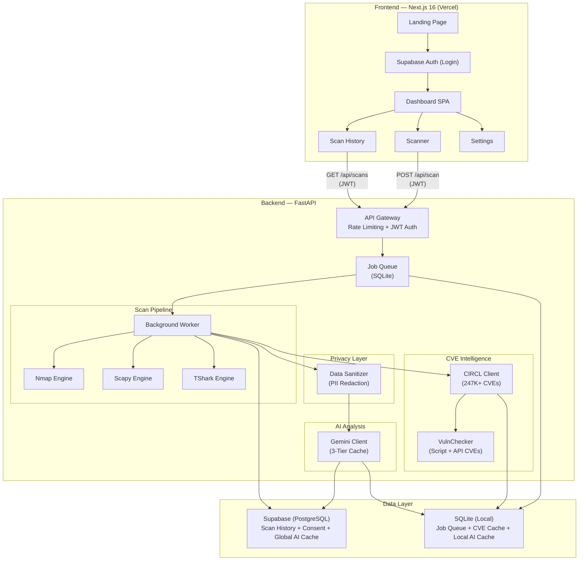
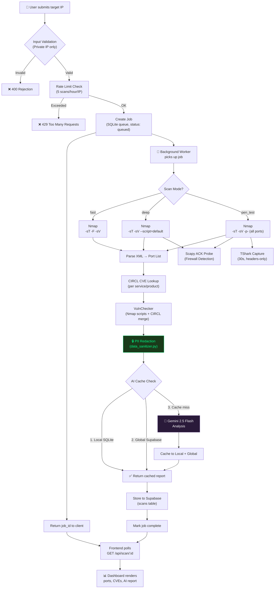
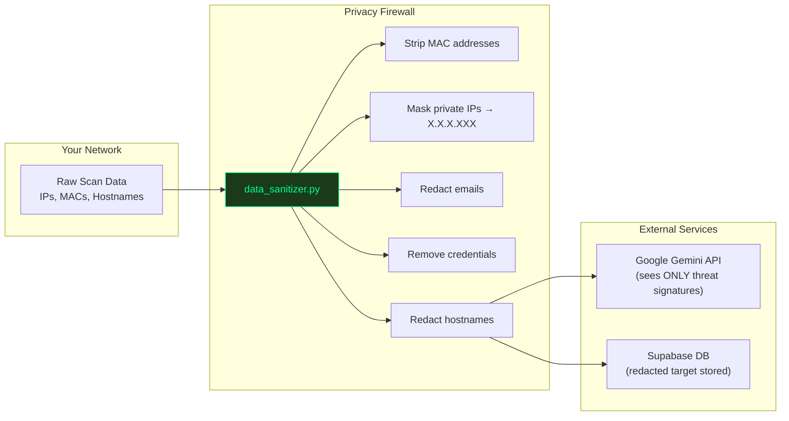

# 🛡️ Aegir

> *Automated Network Vulnerability Scanning & AI-Powered Threat Intelligence*


---

## 🚩 Problem Statement

Network security tools generate high-fidelity data, but the output is often too cryptic for non-experts to act on quickly. Critical services remain exposed because remediation guidance is unclear or buried in raw logs.

---

## 💡 The Solution

**Aegir** turns raw network telemetry into clear, actionable security guidance:

1.  **Scans** the network using industry-standard engines (Nmap, Scapy & TShark).
2.  **Correlates** discovered services against **247K+ real CVEs** from the CIRCL vulnerability database — pure determinism, no AI at this stage.
3.  **Analyzes** findings using **Google Gemini 2.5 Flash** to produce plain-English remediation reports.
4.  **Protects** user privacy at every stage — PII is stripped before any data leaves the server.

It turns *"Port 445 Open (Microsoft-DS)"* into *"High Risk: Your file sharing service is exposed. Block it using this firewall command..."*

---

## ⚙️ System Architecture

The application is built on a **decoupled full-stack architecture** with an async job queue, Supabase authentication, and a 3-tier AI caching layer.



### Backend Stack (FastAPI + Uvicorn)

| Component | Technology | Purpose |
|---|---|---|
| **Server** | FastAPI + Uvicorn ASGI | Async REST API with automatic OpenAPI docs |
| **Auth** | Supabase JWT (ES256) | Stateless token verification via JWKS endpoint |
| **Job Queue** | SQLite-backed FIFO | Async scan queuing with background worker thread |
| **Scanning** | Nmap, Scapy, TShark | Port scanning, firewall detection, packet capture |
| **CVE Database** | CIRCL API + SQLite cache | Deterministic vulnerability correlation (7-day TTL) |
| **AI Engine** | Google Gemini 2.5 Flash | Threat analysis with 3-tier caching (Local → Global → API) |
| **Privacy** | Custom PII Sanitizer | Regex-based redaction of MACs, IPs, emails, credentials |

### Frontend Stack (Next.js 16 + React 19)

| Component | Technology | Purpose |
|---|---|---|
| **Framework** | Next.js 16 (Turbopack) | Server components, middleware auth, API rewrites |
| **UI Library** | React 19.2 | Modern hooks, client components |
| **Auth** | Supabase SSR | Cookie-based session management with middleware guards |
| **Visualization** | Recharts, React Three Fiber | Severity charts, 3D particle background |
| **Styling** | Vanilla CSS | Custom cyberpunk design system (Syne + JetBrains Mono) |
| **Animation** | Framer Motion | Page transitions, micro-interactions |
| **Security** | DOMPurify | XSS sanitization for AI-generated markdown |

---

## 🔄 Process Flow — Scan Pipeline

The following flowchart details what happens from the moment a user clicks "Scan" to receiving their threat report.



### Scan Modes

| Mode | Nmap Flags | Scapy | TShark | CVE Source | Est. Time |
|---|---|---|---|---|---|
| **Fast** | `-Pn -sT -F -sV` | ❌ | ❌ | CIRCL API | ~38s |
| **Deep** | `-Pn -sT -sV --script=default` | ✅ Port 80 | ❌ | VulnChecker + CIRCL | ~105s |
| **Pen Test** | `-Pn -sT -sV -p-` (all ports) | ✅ Port 445 | ✅ 30s capture | VulnChecker + CIRCL | ~225s |

---

## 🔒 Privacy Architecture

Privacy is not a feature — it is embedded into the system architecture. Data is sanitized at multiple layers before it ever reaches an external service.



### Privacy Guarantees

| Layer | Protection | Implementation |
|---|---|---|
| **Input Validation** | Only private/loopback IPs accepted | `validators.py` rejects public IPs, validates CIDR ranges |
| **PII Redaction** | MACs, IPs, emails, passwords stripped | `data_sanitizer.py` — recursive regex across all nested data |
| **Token Optimization** | Only essential port/service data sent to AI | `token_optimizer.py` removes noise, keeps actionable fields |
| **AI Context** | Gemini sees threat signatures, not topology | `redact_enriched_scan()` runs before any Gemini call |
| **Consent Management** | GDPR-style explicit consent for advanced scans | `consent_manager.py` — versioned policy, revocable consent |
| **TShark Privacy** | Only packet headers captured (80 bytes) | `-s 80` flag — payload data never captured |
| **AI Cache Privacy** | Cache keys are SHA-256 hashes of vulnerability profiles | No IPs or user data in cache signatures |

### What The AI Sees vs. What It Doesn't

| ✅ AI Receives | ❌ AI Never Receives |
|---|---|
| Port numbers (22, 80, 443...) | IP addresses |
| Service names (ssh, http...) | Hostnames |
| Product/version (Apache 2.4.49) | MAC addresses |
| CVE IDs + CVSS scores | Email addresses |
| Threat severity classification | Passwords/credentials |
| Protocol metadata | Network topology |

---

## 📂 Directory Structure

```
aegir/
│
├── 📄 server.py                         # FastAPI entry (routes, middleware, worker bootstrap)
├── 📄 requirements.txt                  # Python dependencies
├── 📄 .env.example                      # Backend env template
│
├── 📁 config/                           # Configuration
│   └── settings.py                      # Application constants
│
├── 📁 src/                              # Core Backend Source
│   │
│   ├── 📁 auth/                         # 🔐 Authentication
│   │   └── middleware.py                # Supabase JWT verification (ES256 JWKS)
│   │
│   ├── 📁 database/                     # 💾 Data Persistence
│   │   ├── supabase_client.py           # Supabase SDK: scan storage + global AI cache
│   │   └── consent_manager.py           # GDPR-style consent: grant, check, revoke
│   │
│   ├── 📁 queue/                        # ⚡ Async Job Queue
│   │   ├── job_manager.py               # SQLite FIFO: create, poll, complete, fail
│   │   └── worker.py                    # Background thread: scan pipeline orchestrator
│   │
│   ├── 📁 scanner/                      # 🔍 Network Scanning Engines
│   │   ├── nmap_engine.py               # Nmap: port scan, service detection, XML parsing
│   │   ├── scapy_engine.py              # Scapy: ACK packet firewall detection
│   │   ├── tshark_engine.py             # TShark: header-only packet capture + summary
│   │   └── tshark_capture.py            # Legacy TShark module
│   │
│   ├── 📁 vuln_lookup/                  # 🛡️ CVE Intelligence
│   │   ├── circl_client.py              # CIRCL API: CVE lookup, 7-day SQLite cache, DNS fallback
│   │   └── vuln_checker.py              # Dual-phase CVE: Nmap scripts + CIRCL API
│   │
│   ├── 📁 ai_agent/                     # 🤖 AI Analysis Engine
│   │   ├── gemini_client.py             # Gemini 2.5: 3-tier cache, model fallback chain
│   │   ├── prompts.py                   # System prompt: structured output format
│   │   └── report_generator.py          # Report assembly
│   │
│   └── 📁 utils/                        # 🔧 Utilities
│       ├── data_sanitizer.py            # PII redaction: MACs, IPs, emails, credentials
│       ├── token_optimizer.py           # AI token pruning: strip noise, keep signal
│       └── validators.py               # IP/CIDR validation: private-only enforcement
│
├── 📁 data/                             # Local databases (gitignored)
│   ├── jobs.db                          # Job queue state
│   ├── cve_cache.db                     # CIRCL CVE cache (7-day TTL)
│   └── ai_cache.db                      # Local AI report cache
│
└── 📁 frontend/                         # Next.js 16 Frontend
    ├── 📄 package.json                  # Dependencies (React 19, Next 16, Supabase SSR)
    ├── 📄 next.config.js                # API rewrites, security headers
    ├── 📄 middleware.js                 # Supabase session → route guards
    ├── 📄 .env.example                  # Frontend env template
    │
    ├── 📁 app/                          # Next.js App Router
    │   ├── layout.jsx                   # Root layout (Syne + JetBrains Mono fonts)
    │   ├── globals.css                  # Global styles + cyberpunk design system
    │   ├── page.jsx                     # Landing page (hero, features, privacy, CTA)
    │   │
    │   ├── 📁 login/                    # Auth
    │   │   └── page.jsx                 # Supabase email/password + OAuth login
    │   │
    │   └── 📁 dashboard/                # Protected routes (auth-gated)
    │       ├── layout.jsx               # Sidebar layout + server-side auth check
    │       ├── page.jsx                 # Overview: recent scans, severity charts
    │       │
    │       ├── 📁 scan/                 # Scanner
    │       │   ├── page.jsx             # Scan form + real-time result viewer
    │       │   └── 📁 [id]/             # Dynamic scan result page
    │       │
    │       ├── 📁 history/              # Scan History
    │       │   ├── page.jsx             # Past scans + Supabase actions
    │       │   └── actions.js           # Server actions (delete history)
    │       │
    │       └── 📁 settings/             # User Settings
    │           └── page.jsx             # Consent management, account
    │
    ├── 📁 components/                   # Shared Components
    │   ├── DashboardClient.jsx          # Dashboard overview widget
    │   ├── ScanResultClient.jsx         # Full scan result renderer (ports, CVEs, AI)
    │   ├── HistoryClient.jsx            # Scan history table
    │   ├── SidebarNav.jsx               # Dashboard sidebar navigation
    │   ├── SidebarFooter.jsx            # Sidebar user info + logout
    │   ├── Navbar.jsx                   # Landing page navbar
    │   ├── Footer.jsx                   # Landing page footer
    │   └── ParticleBackground.jsx       # Three.js 3D particle field
    │
    ├── 📁 hooks/                        # Custom React Hooks
    │   └── useScrollAnimation.js        # Scroll-triggered reveal animations
    │
    └── 📁 lib/                          # Utilities
        └── localCache.js               # In-memory scan cache (15s TTL)
```

### Notes on Directory Structure

- ✅ **Committed**: All source code, config templates (`.env.example`), documentation
- ❌ **Gitignored**: `node_modules/`, `__pycache__/`, `.venv/`, `data/`, `logs/`, `.env`, `.next/`
- 🔐 **Secrets**: API keys, Supabase credentials, and backend URLs are never committed
- 🗄️ **Local DBs**: `data/*.db` files are auto-created at runtime, never committed

---

## 💻 Local Development Setup

### Prerequisites

| Dependency | Version | Notes |
|---|---|---|
| **Python** | 3.12+ | Tested with 3.12.6 |
| **Node.js** | 20+ | Required for Next.js 16 |
| **Nmap** | Latest | Must be on PATH. [Download](https://nmap.org/download.html) |
| **Npcap** (Windows) | Latest | Required for Scapy. Bundled with Nmap installer |
| **Google API Key** | — | [Get one from AI Studio](https://aistudio.google.com/app/apikey) |
| **Supabase Project** | — | [Create at supabase.com](https://supabase.com) |

> **Optional**: Scapy (firewall detection) and TShark (packet capture) require elevated privileges. The system gracefully degrades if they are unavailable.

### Installation

#### 1. Clone the Repository
```bash
git clone https://github.com/Kalpesh-ops/netsec-ai-scanner.git
cd netsec-ai-scanner
```

#### 2. Backend Setup
```bash
# Create virtual environment
python -m venv .venv

# Activate (Windows)
.\.venv\Scripts\Activate.ps1

# Activate (macOS/Linux)
source .venv/bin/activate

# Install dependencies
pip install -r requirements.txt
```

#### 3. Configure Environment Variables

**Backend** — copy `.env.example` → `.env` (project root):
```env
GOOGLE_API_KEY=your_gemini_api_key
SUPABASE_URL=https://your-project.supabase.co
SUPABASE_ANON_KEY=your_anon_key
SUPABASE_SERVICE_ROLE_KEY=your_service_role_key
ALLOWED_HOSTS=localhost,127.0.0.1
```

**Frontend** — copy `frontend/.env.example` → `frontend/.env.local`:
```env
NEXT_PUBLIC_SUPABASE_URL=https://your-project.supabase.co
NEXT_PUBLIC_SUPABASE_ANON_KEY=your_anon_key
NEXT_PUBLIC_API_URL=http://localhost:8000
```

#### 4. Frontend Setup
```bash
cd frontend
npm install
```

### Running the Application

#### Start Backend (API + Worker)
```bash
python server.py
```
This starts:
- **FastAPI server** on `http://127.0.0.1:8000`
- **Background worker thread** that processes queued scan jobs

#### Start Frontend
```bash
cd frontend
npm run dev
```
Frontend available at `http://localhost:3000`

#### Run as an Electron desktop app (optional)

The Electron shell launches the Python backend + Next frontend together in a
single window, with auto-update hooks wired against GitHub Releases. See
[`docs/architecture/electron.md`](docs/architecture/electron.md) for the full
three-process model, security posture, and packaging roadmap.

```bash
# one-time
npm install
npm --prefix frontend install

# launches backend + next dev + electron, with coloured log streams
npm run dev
```

Packaged installers (Windows NSIS, macOS DMG, Linux AppImage) are produced by
`npm run electron:build:win|mac|linux` — Python bundling via PyInstaller and
Windows EV code-signing are tracked as follow-up PRs and are **not required
for development use**.

### API Endpoints

| Method | Endpoint | Auth | Description |
|---|---|---|---|
| `POST` | `/api/scan` | JWT | Queue a new scan job |
| `GET` | `/api/scan/:id` | JWT | Poll scan job status/result |
| `GET` | `/api/scans` | JWT | List user's last 10 scans |
| `DELETE` | `/api/scans` | JWT | Clear user's local scan history |
| `GET` | `/api/consent` | JWT | Check user consent status |
| `POST` | `/api/consent` | JWT | Grant consent for advanced scans |
| `DELETE` | `/api/consent` | JWT | Revoke consent |
| `POST` | `/api/analyze` | — | Direct AI analysis (rate-limited) |
| `GET` | `/health` | — | Health check |

> Interactive API docs available at `http://localhost:8000/docs` (Swagger UI)

---

## ✨ Key Features

- **🔍 Multi-Engine Scanning**: Nmap (port/service), Scapy (firewall), TShark (traffic capture)
- **🛡️ Deterministic CVE Correlation**: CIRCL database with 247K+ real CVEs — zero AI hallucination at this stage
- **🤖 AI-Powered Reports**: Gemini 2.5 Flash translates findings into executive-grade remediation playbooks
- **🔒 Privacy by Architecture**: PII stripped before any external API call. Network topology never leaves unredacted.
- **⚡ 3-Tier AI Caching**: Local SQLite → Global Supabase → Gemini API. Identical scans hit cache instantly.
- **🔐 Supabase Auth**: Email/password + OAuth login with JWT-protected API routes
- **📊 Real-Time Dashboard**: Scan progress, severity charts (Recharts), scan history with Supabase persistence
- **🎮 Cyberpunk UI**: Custom design system — Syne typography, 3D particle backgrounds, terminal-style animations
- **🛡️ Consent Management**: GDPR-style explicit consent with versioned policies, grant/revoke API
- **⏱️ Async Job Queue**: Non-blocking scan execution via SQLite-backed FIFO queue with background worker

---

## 🔌 API Usage Examples

### Queue a Network Scan
```bash
curl -X POST "http://localhost:8000/api/scan" \
  -H "Content-Type: application/json" \
  -H "Authorization: Bearer YOUR_SUPABASE_JWT" \
  -d '{
    "target": "192.168.1.1",
    "scan_mode": "fast"
  }'
```

### Response
```json
{
  "scan_id": "a1b2c3d4-e5f6-7890-abcd-ef1234567890",
  "status": "queued",
  "message": "Scan queued successfully"
}
```

### Poll Scan Status
```bash
curl "http://localhost:8000/api/scan/a1b2c3d4-e5f6-7890-abcd-ef1234567890" \
  -H "Authorization: Bearer YOUR_SUPABASE_JWT"
```

---

## 🧰 Technology Stack

### Backend
| Package | Version | Purpose |
|---|---|---|
| `fastapi` | 0.128.0 | Async REST API framework |
| `uvicorn` | 0.40.0 | ASGI server |
| `google-generativeai` | 0.8.5 | Gemini 2.5 Flash SDK |
| `supabase` | 2.28.2 | Supabase Python client (auth, DB) |
| `scapy` | 2.7.0 | Packet crafting & firewall detection |
| `python-jose` | 3.5.0 | JWT token verification |
| `python-dotenv` | 1.0.0 | Environment variable management |
| `requests` | 2.31.0 | HTTP client (CIRCL API) |

### Frontend
| Package | Version | Purpose |
|---|---|---|
| `next` | 16.2.1 | React framework (App Router + Turbopack) |
| `react` | 19.2.4 | UI library |
| `@supabase/ssr` | 0.9.0 | Server-side Supabase auth |
| `@supabase/supabase-js` | 2.99.3 | Supabase client SDK |
| `recharts` | 3.8.0 | Severity distribution charts |
| `framer-motion` | 12.29.2 | UI animations |
| `@react-three/fiber` | 9.5.0 | 3D particle background |
| `lucide-react` | 0.563.0 | Icon library |
| `react-markdown` | 10.1.0 | AI report rendering |
| `dompurify` | 3.3.3 | XSS sanitization |

### Cloud & Infrastructure
| Service | Purpose |
|---|---|
| **Google Gemini 2.5 Flash** | AI threat analysis engine |
| **Supabase (PostgreSQL)** | Auth, scan history, global AI cache, consent |
| **CIRCL CVE Database** | Public CVE lookup API (247K+ entries) |
| **Vercel** | Frontend hosting (Edge CDN + SSR) |

---

## 🌐 Production Deployment

### Live Application
**Frontend:** [https://aegir.vercel.app](https://aegir.vercel.app)

### Deployment Architecture

| Layer | Platform | Details |
|---|---|---|
| **Frontend** | Vercel | Next.js SSR, Edge CDN, auto HTTPS |
| **Backend** | Self-hosted | Ubuntu + Nginx reverse proxy, Let's Encrypt SSL |
| **Database** | Supabase | Managed PostgreSQL with Row-Level Security |
| **DNS** | `.nip.io` wildcard | SSL certificate validation for IP-based domains |

### Security Hardening
- **End-to-End Encryption**: All traffic over HTTPS (HSTS enabled)
- **CORS Whitelist**: Only production frontend origin allowed
- **Security Headers**: `X-Content-Type-Options`, `X-Frame-Options`, `X-XSS-Protection`, HSTS (via both Next.js and FastAPI middleware)
- **Rate Limiting**: 5 scans/hour, 60 status polls/min, 10 analyses/min per IP
- **Trusted Host Middleware**: Request validation against allowed hostnames
- **Input Validation**: Strict regex for IPs, CIDR ranges, and scan parameters
- **No Secrets in Code**: All credentials via environment variables, never committed

> **Security Note:** The production backend URL is intentionally not published in documentation to prevent unauthorized access and abuse of scanning capabilities.

---

## 📄 License

This project is licensed under the Apache License 2.0 — see the [LICENSE](LICENSE) file for details.

---

## 🤝 Contributing

Contributions are welcome! Please read [CONTRIBUTING.md](CONTRIBUTING.md) before submitting a Pull Request.

---

## 📧 Contact

For questions, security disclosures, or support — please open an issue or see [SECURITY.md](SECURITY.md).